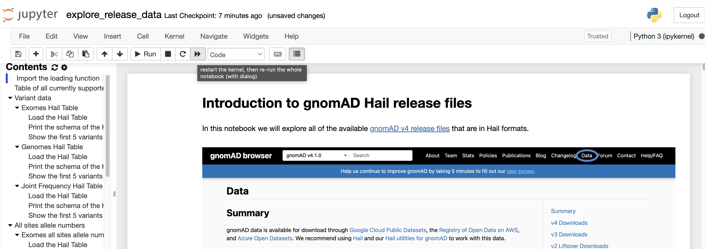

# gnomad-toolbox: Simplifying Access and Analysis of gnomAD Data


The gnomAD Toolbox is a Python package designed to streamline the use of gnomAD Hail Tables. The Genome Aggregation Database (gnomAD) is a widely used resource for understanding genetic variation, offering large-scale data on millions of variants across diverse populations. This toolbox simplifies tasks like loading, filtering, and analyzing gnomAD data, making it more accessible to researchers.

> **Disclaimer:** This package is in its early stages of development, and we are actively working on improving it. There may be bugs, and the API is subject to change. Feedback and contributions are highly encouraged.

---

## Repository Structure

The package is organized as follows:

```
gnomad_toolbox/
│
├── load_data.py         # Functions to load gnomAD release Hail Tables.
│
├── filtering/           # Modules for filtering gnomAD data.
│   ├── constraint.py    # Filter by constraint metrics (e.g., observed/expected ratios).
│   ├── coverage.py      # Filter by coverage thresholds.
│   ├── frequency.py     # Filter by allele frequency thresholds.
│   ├── pext.py          # Filter by predicted expression (pext) scores.
│   ├── variant.py       # Filter specific variants or sets of variants.
│   ├── vep.py           # Filter by VEP (Variant Effect Predictor) annotations.
│
├── analysis/            # Analysis functions.
│   ├── general.py       # General-purpose analyses, such as summarizing variant statistics.
│
├── notebooks/           # Example Jupyter notebooks.
│   ├── explore_release_data.ipynb       # Guide to loading gnomAD release data.
│   ├── intro_to_filtering_variant_data.ipynb # Introduction to filtering gnomAD variants.
│   ├── dive_into_secondary_analyses.ipynb   # Secondary analyses using gnomAD data.
```

---

## Set Up Your Environment for Hail and gnomAD Toolbox

This section provides step-by-step instructions to set up a working environment for using Hail and the gnomAD Toolbox.

> We provide this guide to help you set up your environment, but we cannot guarantee that it will work on all systems. If you encounter any issues, you can reach out to us on the [gnomAD Forum](https://discuss.gnomad.broadinstitute.org), and if it is something that we have come across before, we will try to help you out.

### Prerequisites

Before installing the toolbox, ensure the following:
- Administrator access to install software.
- A working Python >3.9 environment.
- Java **11**.
  > For macOS: [Hail recommends](https://hail.is/docs/0.2/install/macosx.html) using a packaged installation from [Azul](https://www.azul.com/downloads/?version=java-11-lts&os=macos&package=jdk&show-old-builds=true) or using [Homebrew](https://brew.sh/):
  > ```commandline
  > brew tap homebrew/cask-versions
  > brew install --cask temurin8
  > ```
  > Make sure to choose a Java installation with a compatible architecture (Can be found in “Apple Menu > About This Mac”), Apple M1/M2 must use an “arm64” Java, otherwise use an “x86_64” Java.

### Install Miniconda

Miniconda is a lightweight distribution of Conda.

1. Download Miniconda from the [official website](https://docs.anaconda.com/miniconda/install/).
2. Follow the installation instructions described on the download page for your operating system.
3. Verify installation:
   ```commandline
   conda --version
   ```

### Set Up a Conda Environment

Create and activate a new environment with a specified Python version for the gnomAD Toolbox:
```commandline
conda create -n gnomad-toolbox python=3.11
conda activate gnomad-toolbox
```

### Install gnomAD Toolbox
- To install from PyPI:
  ```commandline
  pip install gnomad-toolbox
  ```
- To install the latest development version from GitHub:
  ```commandline
  pip install git+https://github.com/broadinstitute/gnomad-toolbox@main
  ```

> **Troubleshooting:** If you encounter an error such as `Error: pg_config executable not found`, install the `postgresql` package:
> ```commandline
> conda install postgresql
> ```


### Verify the Installation

Start a Python shell and ensure that Hail and the gnomAD Toolbox are set up correctly:
```python
import hail as hl
import gnomad_toolbox
hl.init()
print("Hail and gnomad_toolbox setup is complete!")
```

---

## Available Example Notebooks

The gnomAD Toolbox includes Jupyter notebooks to help you get started with gnomAD data:

- **Explore Release Data:**
   - Learn how to load and inspect gnomAD release data.
   - Notebook: `explore_release_data.ipynb`

- **Filter Variants:**
   - Understand how to filter variants using different criteria.
   - Notebook: `intro_to_filtering_variant_data.ipynb`

- **Perform Secondary Analyses:**
   - Explore more advanced analyses using gnomAD data.
   - Notebook: `dive_into_secondary_analyses.ipynb`

## Run the Example Notebooks Locally
> If you already have experience with Google Cloud and using Jupyter notebooks, you can skip this section and use the notebooks in your preferred environment.

### Install the Cloud Storage Connector

Hail uses the Google Cloud Storage Connector to read and write data from Google Cloud Storage. The easiest way to install the connector is to use the `install-gcs-connector` script provided by the Broad Institute:
```commandline
curl -sSL https://broad.io/install-gcs-connector | python3 - --auth-type UNAUTHENTICATED
```

### Copy and Open the Notebooks

1. Copy the notebooks to a directory of your choice:
   ```commandline
   copy-gnomad-toolbox-notebooks /path/to/your/notebooks
   ```
   > If the specified directory already exists, you will need to provide a different path, or if you want to overwrite the existing directory, you will need to add the `--overwrite` flag:
   >   ```commandline
   >   copy-gnomad-toolbox-notebooks /path/to/your/notebooks --overwrite
   >   ```

2. Start Jupyter with gnomad-toolbox specific configurations:
   - For Jupyter Notebook:
     ```commandline
     gnomad-toolbox-jupyter notebook
     ```
   - For Jupyter Lab:
     ```commandline
     gnomad-toolbox-jupyter lab
     ```

   > These commands will start a Jupyter notebook/lab server and open a new tab in your default web browser. The notebook directory containing the example notebooks will be displayed.

3. Open the `explore_release_data.ipynb` notebook to learn how to load gnomAD release data:
   - Run all cells by clicking on the >> button in the toolbar (shown in the image below) or by selecting "Run All" from the "Cell" menu.
      

4. Explore the other notebooks described above.

5. Try adding your own queries to the notebooks to explore the data further.
   > **WARNING:** Avoid running queries on the full dataset as it may take a long time.

---

## Resources

### gnomAD:
- [gnomAD Toolbox Documentation](https://broadinstitute.github.io/gnomad-toolbox/)
- [gnomAD Browser](https://gnomad.broadinstitute.org/)
- [gnomAD Download Page](https://gnomad.broadinstitute.org/downloads)
- [gnomAD Forum](https://discuss.gnomad.broadinstitute.org)

### Hail:
- [Hail Documentation](https://hail.is/docs/0.2/index.html)
- [Hail Discussion Forum](https://discuss.hail.is/)

---

## Contributing

We welcome contributions to the gnomAD Toolbox! See the [CONTRIBUTING.md](CONTRIBUTING.md) file for more information.

---

## License

This project is licensed under the BSD 3-Clause License. See the [LICENSE](LICENSE) file for details.
